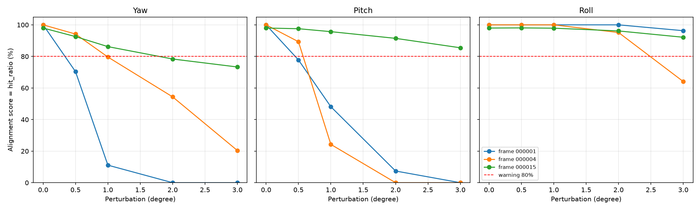
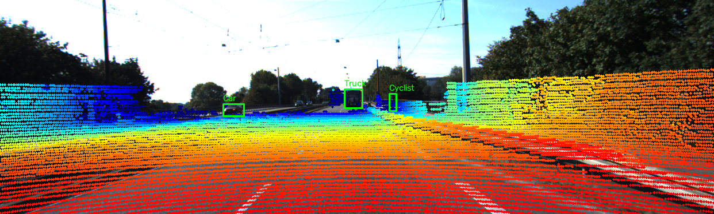

# Báo cáo Day 6: Kiểm tra calibration LiDAR-camera

- **Họ tên:** Nguyễn Tuấn Khanh
- **MSSV:** 2A202602819
- **Lớp:** AI20K-T4
- **Link repo:** https://github.com/Ataraxiza/NguyenTuanKhanh-2A202602819-Track4-Day21
- **Topic:** A — Kiểm tra calibration LiDAR-camera
- **Dataset:** data/kitti_mini
- **Các frame đã dùng:** 000015 (nhiều người đi bộ), 000001 (có cyclist), 000004 (xe xa hơn 50 m)

> Mỗi mục ngắn gọn, ưu tiên số liệu và hình ảnh.

## 1. Claim

Trên ba frame KITTI được chọn, perturb calibration +2° theo yaw sẽ làm alignment score (hit_ratio) giảm ít nhất 20 điểm phần trăm so với calibration gốc và gây ảnh hưởng mạnh hơn pitch hoặc roll ở cùng mức perturb. Các object nhỏ, hẹp, ít điểm LiDAR hoặc ở xa được kỳ vọng có mức giảm hit_ratio lớn hơn.

## 2. Evidence

Bảng dưới tổng hợp trực tiếp các dòng mức 0° và +2° trong `results/calibration_sweep.csv`. Alignment score được tính bằng tổng `hits` chia tổng `object_points` qua ba frame, không phải trung bình đơn giản của từng object. Mỗi lần chỉ perturb một trục; baseline không perturb là 98.09%.

| Trục perturb riêng | Baseline 0° | Score ở +2° | Giảm so với baseline |
|---|---:|---:|---:|
| Yaw | 98.09% | 76.34% | 21.76 pp |
| Pitch | 98.09% | 85.42% | 12.67 pp |
| Roll | 98.09% | 96.14% | 1.95 pp |

Với ngưỡng thử 80%, chỉ yaw vượt ngưỡng cảnh báo ở kết quả tổng hợp. Độ nhạy phụ thuộc frame và object: ở frame 000004, pitch +2° cho 0/103 hit, trong khi ở frame 000001 roll +2° vẫn cho 27/27 hit.



## 3. Failure case

Frame 000001 ở yaw +2° là failure case rõ ràng: cyclist chỉ có 18 điểm được đánh giá và 0 điểm nằm trong bbox; chiếc xe có 0/9. Đây là lỗi Geometry do extrinsic perturb làm lệch phép chiếu. Tuy nhiên, cùng frame ở roll +2° vẫn có 18/18 điểm cyclist và 9/9 điểm xe trong bbox. Vì vậy, kết quả bác bỏ cách diễn giải rằng bất kỳ trục nào ở 2° cũng sẽ làm mọi object/frame giảm đáng kể; tác động phụ thuộc trục và hình học cảnh.



Đây cũng là giới hạn Metric: với object chỉ có 9–18 điểm, một vài điểm thay đổi đã làm tỷ lệ biến động mạnh; ngược lại, roll có thể không làm các điểm của frame này rời bbox dù extrinsic đã bị perturb. Ngoài ra, `object_points` trong CSV chỉ đếm điểm còn hợp lệ sau phép chiếu vào ảnh, nên mẫu số có thể thay đổi giữa các mức perturb. Do đó, 80% chỉ là ngưỡng cảnh báo thử nghiệm cần kiểm tra trên dữ liệu rộng hơn; khi triển khai nên theo dõi riêng theo class/khoảng cách, dùng tập điểm object cố định và xác nhận cảnh báo qua nhiều frame liên tiếp.

## 4. Khuyến nghị nếu triển khai thật

Với ADAS, nên theo dõi riêng score của yaw, pitch và roll, đồng thời log frame, class, khoảng cách, số điểm đủ điều kiện, số hit và tỷ lệ điểm còn trong ảnh. Có thể dùng 80% làm ngưỡng ban đầu để thử nghiệm, rồi hiệu chỉnh trên dữ liệu vận hành có ground truth; cảnh báo qua nhiều frame giảm báo động giả nhưng làm tăng độ trễ phát hiện. Cần cân bằng độ trễ này với yêu cầu an toàn và chi phí tính toán của việc duy trì thống kê theo object.

## 5. Cách chạy lại

Chạy từ thư mục gốc của repo và kích hoạt venv để dùng các thư viện trong `requirements.txt`.

```powershell
.\.venv\Scripts\Activate.ps1
python -m src.exp_calibration_sweep --data-root data/kitti_mini --frames 000015 000001 000004 --perturb-type all --warning-threshold 0.8 --drop-threshold-pp 20.0
python -m src.plot_calibration_sweep
```

## 6. Khai báo sử dụng AI

| Công cụ | Dùng cho việc gì | Bạn đã kiểm chứng thế nào |
|---|---|---|
| ChatGPT / GitHub Copilot | Hỗ trợ phân tích CSV, diễn đạt claim và rà soát báo cáo | Tự chạy benchmark trong venv, đối chiếu số liệu báo cáo với CSV và chạy `python tools/check_submission.py` |
